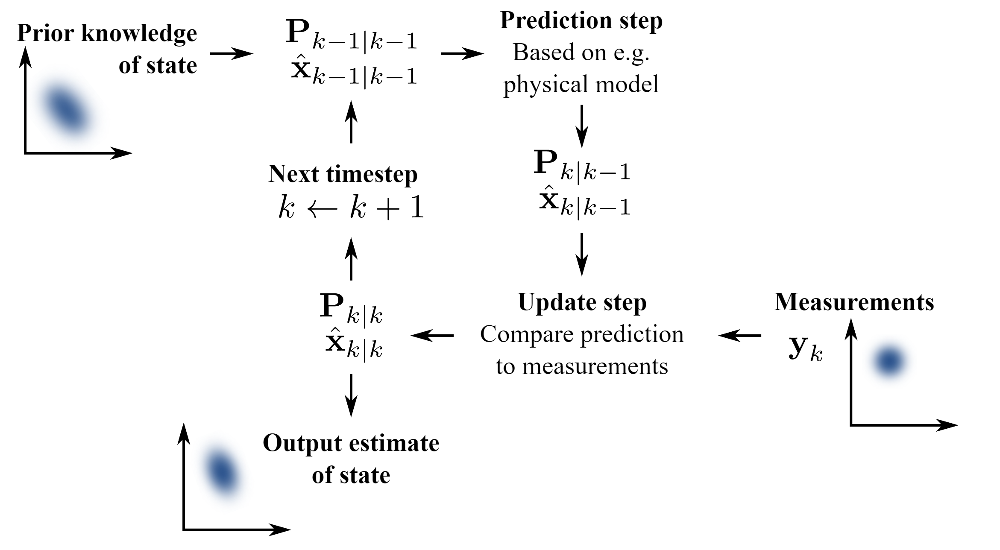

# Kalman Filter
Kalman filter is a two step process that first predicts the next state of the system by calculating with the system's model and known control inputs. Then updating the output by combining it with sensor measurements. Kalman filter's final output is somewhere in between the calculated output and sensor measurement; this ratio is known as kalman gain.

Predict step

$$F = e^{A*dt} \~= I+Adt$$

predicted state estimate

$$\dot x = Ax+Bu$$

$$\frac{x[k+1]-x[k]}{dt} = Ax[k] + Bu[k]$$

$$x[k+1] = x[k] + dt(Ax[k] + Bu[k])$$

$$x[k+1] = (I+Adt)x[k] + dtBu[k]$$

$$F = I + A*dt$$

$$x[k+1] = Fx[k] + dtBu[k]$$

predicted covariance estimate

$$P[k+1] = FP[k]F.T + dtQ$$

---

Update step

calculate Kalman gain

$$K = P[k]C.T/(CP[k]C.T + R)$$

update state estimate

$$x[k] = x[k] + K(y - Cx[k])$$

Can see taking the difference between measurement y and the calculated state output Cx. Then taking a portion of the difference (Kalman gain) and adding it to the predicted state to find the final state

update covariance estimate

$$P[k] = (I - KC)P[k]$$

# plots
w=0.5, v=0.5
w=1, v= 0
w=0, v=1

# References
[Kalman filter wiki](https://en.wikipedia.org/wiki/Kalman_filter)
