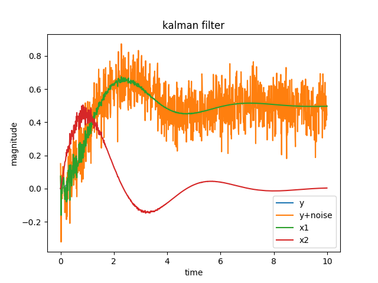

# Kalman Filter
Kalman filter is a two step process that first predicts the next state of the system by calculating with the system's model and known control inputs. Then updating the output by combining it with sensor measurements. Kalman filter's final output is somewhere in between the calculated output and sensor measurement; this ratio is known as kalman gain.

# Predict step

$$F = e^{A*dt} \~= I+Adt$$

predicted state estimate

$$\dot{\hat{x}} = A\hat{x}+Bu$$

$$\frac{\hat{x}[k+1]-\hat{x}[k]}{dt} = A\hat{x}[k] + Bu[k]$$

$$\hat{x}[k+1] = \hat{x}[k] + dt(A\hat{x}[k] + Bu[k])$$

$$\hat{x}[k+1] = (I+Adt)\hat{x}[k] + dtBu[k]$$

$$F = I + A*dt$$

$$\hat{x}[k+1] = F\hat{x}[k] + dtBu[k]$$

predicted covariance estimate

$$\hat{P}[k+1] = F\hat{P}[k]F.T + dtQ$$

# Update step

calculate Kalman gain

$$K = \hat{P}[k]C.T/(C\hat{P}[k]C.T + R)$$

Kalman gain is a raio of 

uncertainty in estimate covariance/ (uncertainty in estimate covariance + uncertainty in measurement)

update state estimate

$$\hat{x}[k] = \hat{x}[k] + K(y - C\hat{x}[k])$$

Can see taking the difference between measurement y and the calculated state output $C\hat{x}$. Then taking a portion of the difference (Kalman gain) and adding it to the predicted state to find the final state

update covariance estimate

$$P[k] = (I - KC)\hat{P}[k]$$

$$P[k] = \hat{P}[k] - KC\hat{P}[k]$$

Can see the covariance estimate matrix is being reduced each step by a kalman gain ratio.

# State Space

$$\dot x = Ax + Bu$$

$$y = Cx + Du$$

where:
x is the state vector, nx1\
y is the output vector, qx1\
u is the input/control vector, px1\
A is the state(system) matrix, nxn\
B is the input matrix, nxp\
C is the output matrix, qxn\
D is the feedforward matrix, qxp

# Probability
$x_n$ is each value in a list of values

Mean is is average value in a data set of numbers.

$$\mu = \frac{1}{N}\sum_{n=1}^N{x_n}$$

Variance is a measurement of how spread out the data is from its mean. $\sigma^2$ holds almost all values in the data set.

$$\sigma^2 = \frac{1}{N}\sum_{n=1}^{N}(x_n - \mu)^2$$

Standard deviation is how far data is relative to its mean. In a gaussian curve, 1 $\sigma$ away from the mean holds 68% of all values of the data set, 2 $\sigma$ away from the mean holds 95% and 3 $\sigma$ away holds 99.7% of the values.

$$\sigma = \sqrt{\frac{1}{N}\sum_{n=1}^N (x_n - \mu)^2}$$

# Noise Covariances

$\hat x$ is the state estimate\
$\hat P$ is the covariance estimate\
Kalman filter assumes that the noises are gaussian shape.\
w is the process noise standard deviation\
Q is the process noise variance\
v is the sensor noise standard deviation\
R is the sensor noise variance\
High values for w means that the process noise is high and the kalman gain should favor the sensor measurement. While low values for w means that the process noise is low and the kalman gain should favor the calculated output. The same goes for v, the measurement noise. 

# Plots
With w = 0.2 and v = 0.8

Can see the ouput y from the model response and with random noise added to the signal becomes y+noise. The estimated states x (position) is somewhere in between the calculated output and measured output.

With w = 1 and v = 0

Can see with high process noise, the kalman gain favors the sensor measurements and the estimated states completely follows the y+noise signal.

With w = 0 and v = 1

Can see with high sensor noise, the kalman gain favors the calculated output and the estimated states follows the y signal without noise.

with noise turned off.

The estimated states can follow the output y signal.

# References
[Kalman filter wiki](https://en.wikipedia.org/wiki/Kalman_filter)

[KalmanFilter.net](https://www.kalmanfilter.net/default.aspx)
